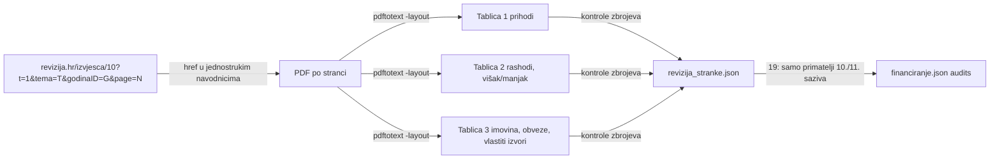

# Financiranje stranaka iz proračuna — bilješke iz izrade (2026-10-09)

Metoda, lanac odluka i postupak ažuriranja su u
[`data/financiranje/README.md`](../data/financiranje/README.md). Ovdje je ono
što bi sljedeći prolaz morao ponovno otkriti.

## Tok podataka

```mermaid
flowchart LR
  NN[Narodne novine<br/>odluke Odbora + izvještaji o izvršenju DP] -->|ručna transkripcija| J1[odluke.json<br/>porezni_prihodi.json]
  SAB[sabor.hr<br/>čl. 11 izvješća, skenirani PDF] -->|ručna transkripcija| J2[izvjesca_cl11.json]
  API[sabor.hr API + 150 profila] -->|18_fetch_sabor_zastupnici.py| J3[zastupnici.json]
  J1 & J2 & J3 --> S19[19_export_financiranje.py<br/>kontrola vs izvješća, projekcija]
  S19 --> F[frontend/public/data/financiranje.json] --> P[/financiranje]
```

## Ključne brojke (stanje 9. 10. 2026.)

| | |
|---|---|
| 10. saziv ukupno | 30.921.034,67 € (29 primatelja) |
| 11. saziv do 30. 9. 2026. | 27.558.188,39 € |
| 11. saziv procjena do 15. 5. 2028. | 49,89 mil. € (50,08 po trendu H1 2026.) |
| Mandat mjesečno M / Ž | 2020: 4.159 / 4.575 € · 2026: 7.009,81 / 7.710,79 € · 2027: 7.328,37 / 8.061,20 € |
| Godišnje svim strankama | 2026: 13.113.949 € (≈ 0,416 €/s) · 2027: 13.709.909,70 € |

## Zamke

- **NN pretraga ignorira tekst upita.** Radi samo sadržaj broja:
  `https://narodne-novine.nn.hr/search.aspx?sortiraj=4&kategorija=1&godina=YYYY&broj=N&rpp=500&qtype=1&pretraga=da`,
  tekst članka: `/clanci/sluzbeni/full/YYYY_MM_BROJ_CLANAK.html`. Potpunost se
  dokazuje pregledom svih brojeva godine.
- **Dvije odluke u istom broju** (NN 90/2020 čl. 1732 = kraj 9. saziva, čl.
  1733 = početak 10.) — ključ u JSON-u je `90/2020-1733`.
- **Tiskane brojke zastupnika znaju biti krive**: NN 107/2021 i NN 11/2022
  pišu HDZ 45+17, iznosi su računati na 46+16. Vjeruj iznosima.
- **Novac ne prati zastupnika** (čl. 7.): 15 od 150 današnjih zastupnika nije u
  stranci koja prima novac za njihov mandat (DOMiNO ×3, Drito ×2, nezavisni,
  Boška Ban: izabrana na SDP listi, danas HDZ). Pripisivanje provjerava i
  listu s koje je izabran(a) (`on_list`, 4-slovne osnove riječi zbog genitiva).
- **sabor.hr profili** su spori (~3 s po stranici, 150 profila ≈ 7 min) →
  cache u `data/raw/sabor/`; `--refresh` samo kad treba.
- **Deploy je pao na tuđem putu**: `src/wallet_alias.py` traži
  `clubs-app.json` iz `ss` repoa, koji je preseljen na
  `/Volumes/DOMOVINA2TB/git/ss/`. Sad postoji fallback i `STRANKE_CLUBS_JSON`.
- **OG tagovi su se duplicirali** u workeru (i na `/stranka/*`): `<head>`
  handler se izvrši prije nego rewriter vidi postojeće `<meta>`. Popravljeno
  ubacivanjem na `</head>` (`onEndTag`).
- **Playwright full-page screenshot ne učitava `loading="lazy"` slike** —
  fotografije zastupnika izgledaju prazne iako rade u pregledniku.
- `/data/*` ima `max-age=3600`: nakon deploya produkcijska domena može kratko
  vraćati stari JSON.

## Otvoreno

- Iznos za 2028. ovisi o ostvarenim poreznim prihodima 2026. (izvještaj ~srpanj 2027.).
- Nova odluka Odbora za 2027. očekuje se u siječnju 2027. (+ izmjene kad se
  promijeni omjer M/Ž) → dodati u `odluke.json` i `PERIODS`.
- „Stranka s imenom i prezimenom" (10. saziv) nema zapis u katalogu stranaka.

## Nastavak 9. 10. 2026.: uživo, makro usporedba, revizije stranaka

### /financiranje/uzivo

`frontend/src/lib/fundingLive.ts` gradi raspored razdoblja s granicama u
ponoć po zagrebačkom vremenu (DST ručno: zadnja nedjelja ožujka/listopada).
Iznos razdoblja / sekunde razdoblja = stopa; kumulativ = završena razdoblja +
linearni udio tekućeg. Kontrola: zbroj = `projection.saziv_total_eur`
(49.893.321,43) u cent, kumulativ na 1. 10. 2026. = `received_eur`.

- Stopa nije konstantna unutar godine: Q4/2026 = 0,4123 €/s, prosjek godine
  0,416 €/s (tromjesečja imaju 90–92 dana, Q4 i sat više zbog DST-a).
- 2027. je „po zakonu“, 2028. „procjena“; oznaka izvora se mijenja sama.
- OG opis u workeru (`livePeriod`) računa stopu samo iz odluka u JSON-u:
  bez nove odluke za 2027. ostaje na stopi Q4/2026.

### Porezi, inflacija i BDP (Eurostat)

`scripts/20_fetch_eurostat_makro.py` → `makro.json` (HICP `prc_hicp_aind`,
`nama_10_gdp` nominalni i realni). 2018. → 2025.: porezi +76,5 %, nominalni
BDP +75,3 %, cijene +34,9 %, realni BDP +27,3 %; porezi su stalno 19–20,4 %
BDP-a. Usporedba nominalnog rasta novca s realnim BDP-om je pogrešna (miješa
nominalno i realno); ispravno je nominalno↔nominalno ili realno↔realno.

### Revizije stranaka (Državni ured za reviziju)

DIP objavljuje godišnje izvještaje stranaka samo kroz svoju aplikaciju bez
javne poveznice (`/financiranje/` vraća 403). Strankama FINA ne prima
izvještaje. Upotrebljiv izvor su **pojedinačna izvješća DUR-a** (tekstualni
PDF, 40–55 stranaka godišnje, sve parlamentarne).



- Popis je straničen po 40 (`&page=2`); bez toga nedostaju stranke iza „R“ (SDP!).
- ID-jevi `godinaID`/`tema` stoje u HTML-u (`data-val`) pod „POLITIČKE STRANKE“
  → pojedinačna izvješća; godina objave = revidirana godina + 1.
- Nova stranka ima tablice s jednim stupcem (bez prethodne godine).
- Iznosi u rečenicama ispod tablice („267.704,00 kn“) zbunjuju brojanje
  stupaca → `table_nums` preskače iznos iza kojeg slijedi kn/eura/%.
  Rezanje tablice na „prvom odlomku“ lomi duge nazive redaka — uklonjeno.
- Centar 2022.: izvornik ima razliku 63 kn u bilanci (revizor to navodi).
- Promjena vlastitih izvora ≠ višak/manjak godine (revalorizacija imovine,
  npr. SDP svake godine), pa to na stranici ne tvrdimo.
- 271 MB PDF-ova u `data/raw/financiranje/revizija/` (gitignorirano).

Brojke (13 stranaka 11. saziva s podacima 2019. i 2024.): vlastiti izvori
6,67 → 8,24 mil. € (+24 %, cijene +28 %), rashodi za zaposlene 3,25 → 3,72
mil. € (+14 %), ukupni manjak 2021. i 2024. (≈ −2,3 mil. € svaki), HDZ drži
68 % vlastitih izvora; Most, Fokus i Pravo i pravda negativni krajem 2024.

### Zamka: PWA + Cloudflare cache

Nakon deploya korisnik nije vidio novi odjeljak. Uzroci:
1. zona domovina.ai na Cloudflareu drži `/sw.js` do 4 h i prepisuje
   Cache-Control u `max-age=14400` (na `*.pages.dev` worker šalje `no-cache`
   ispravno) → preglednik ne vidi novi service worker;
2. `/data/*.json` je StaleWhileRevalidate + HTTP `max-age=3600` → novi kod
   dobije stari JSON, a odjeljak se bez `audits` ne prikaže.

Popravljeno: `?v=__BUILD_ID__` na sve `/data/` JSON-e, reload na
`controllerchange`, `no-cache` za `sw.js` u workeru (nakon isteka stare kopije
Cloudflare ga više ne cacheira: `cf-cache-status: BYPASS`, purge nije trebao).
Treći uzrok: novi SW precachea `/index.html`, a Pages ga preusmjerava (308) na
`/`, koji je bio HTTP-cachiran 5 min → SW je spremio **stari** HTML. Sada
worker `/index.html` poslužuje izravno i sav HTML šalje s `no-cache`.
Provjereno u Braveu: prvo obično učitavanje nakon deploya prikazuje novu verziju.

### Krediti i dugovi pri prestanku stranke

`data/financiranje/krediti.json` je ručni prijepis poglavlja „Obveze“
revizija za 2024. (9 stranaka, 2,67 mil. €; stanja = bilance iz scripts/21).
Za SDP-ov kredit od 2 mil. € izvješće ne navodi osiguranje (cesija +
zadužnica navedeni su samo za okvirne kredite). Pravno: ZPS čl. 10. (statut
uređuje imovinu pri prestanku), čl. 23. (prestanak), ZFPAIP čl. 52. (završni
izvještaj prije brisanja); odredbe o dugovima nema, stranka odgovara svojom
imovinom (primjer: stečaj Bandić 365, tražbine ~284.000 €, imovina 14.520 €).
Pri ažuriranju za 2025. treba ponovno prepisati krediti.json (`as_of`).

### Kod koje banke? (istraženo, bez javnog odgovora)

- DUR u svih 244 izvješća piše samo „poslovna banka“ (pretraga imena banaka
  s granicama riječi: 0 pogodaka; „otp“/„rba“ bez granica su lažni pogoci).
- DIP prilozi (program, financijski plan, donacije) i izvješće o nadzoru
  kampanje za Sabor 2024. (200 str.) ne navode vjerovnike.
- Novac strankama isplaćuje **Ministarstvo financija** (razdjel 025, 02506
  „ostali izdaci države“, A539232, konto 3811). Isplate su javne:
  https://www.drzavna-riznica.hr/trosenje_sredstava_DP/ (pretraga po OIB-u
  primatelja; filtar vrste rashoda ne radi). SDP 2025. = 2.885.312,22 € i
  Most 2024. = 544.707,91 € isplaćeni izravno stranci → cesije se nisu
  aktivirale, banka se u isplatama ne vidi.
- Posebni računi za kampanju 2024. (DIP izvješće): SDP, Most, DP → Erste
  (2402006); IDS → Istarska kreditna banka (2380006); SDSS → PBZ; Centar →
  HPB; Pravo i pravda → Zaba. To nisu dokazi o zajmodavcu, ne objavljivati.
- Put do odgovora: zahtjev po ZPPI Ministarstvu financija (obavijesti o
  cesiji koje je kao cesus primilo za SDP 2023./2024., Most i DP 2024.) i
  DUR-u. Stranke nisu obveznici ZPPI.
